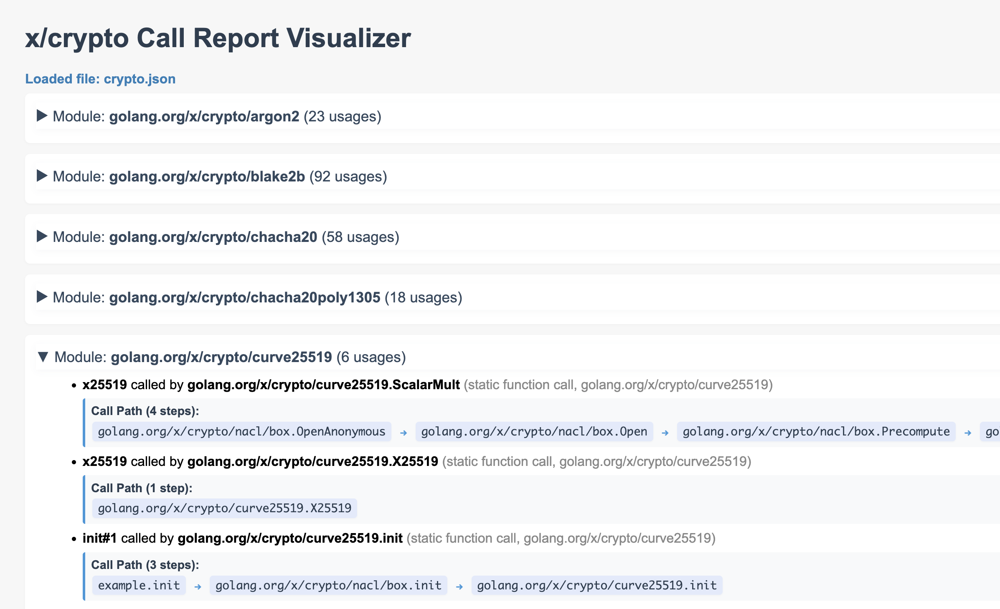

# Go x/crypto FIPS compliance analysis tool

A CLI tool (and HTML viewer) for analyzing Go projects using `callgraph` to detect the usage of cryptographic algorithms from `golang.org/x/crypto` and determining their FIPS 140-2 compliance status.



## Installation

```bash
go mod tidy
go build -o fips-analyzer
```

or

```bash
make all
```

to populate `bin/`.

## Usage

### Basic Analysis

Analyze all packages in a directory:

```bash
./fips-analyzer -source /path/to/source/code
```

### With Entry Point

Analyze starting from a specific entry point:

```bash
./fips-analyzer -source /path/to/source/code -entry ./main.go
```

### Denoise

Attempt to filter out internal crypto function calls, standard library crypto calls, and runtime crypto calls:

```bash
./fips-analyzer -source /path/to/source/code -denoise
```

> [!IMPORTANT]  
> This is intended to make a first pass analysis easier to read, as one legitimate crypto function call from your code may balloon into tens of internal calls to functions in the crypto module, all of which would otherwise be recorded in the output. It should be interpreted as a list of calls to check _first_, but always run another check with denoise **off** to ensure that nothing else is lurking.

### Include Only Non-FIPS Compliant Algorithms

Filter to only unapproved (incl. unknown and must-evaluate) algorithms:

```bash
./fips-analyzer -source /path/to/source/code -unapproved-only
```

### JSON Output

Export results to a JSON file:

```bash
./fips-analyzer -source /path/to/source/code -output results.json
```

> [!NOTE]  
> The JSON output can be dropped onto the [report visualizer](report-visualizer.html) (just open the static html in a browser) to make things nice and pleasant and colorful.

### Verbose Output

Get detailed information about detected usages:

```bash
./fips-analyzer -source /path/to/source/code -verbose
```
